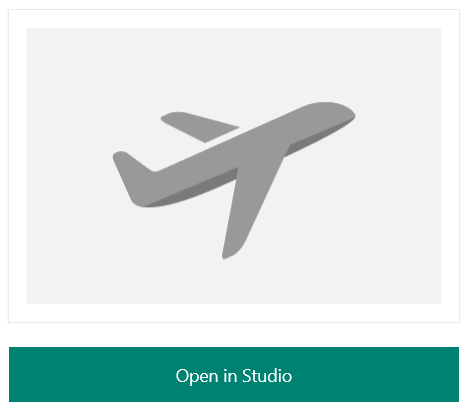
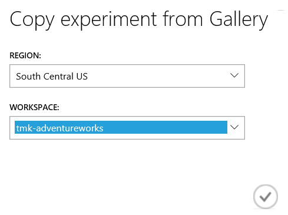
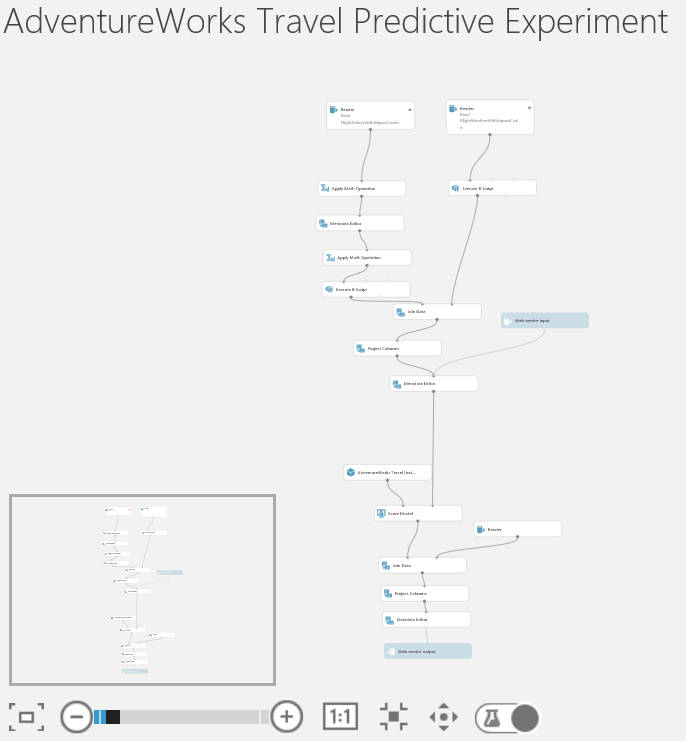
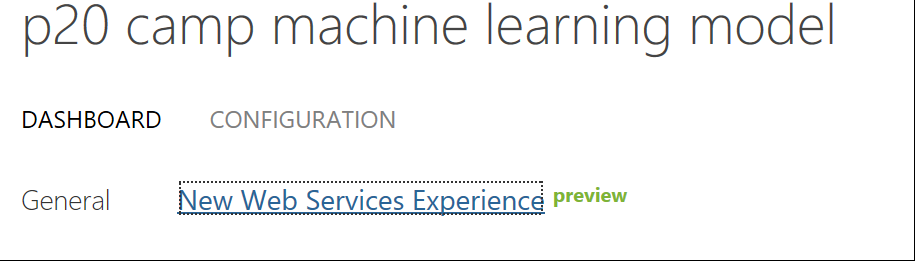
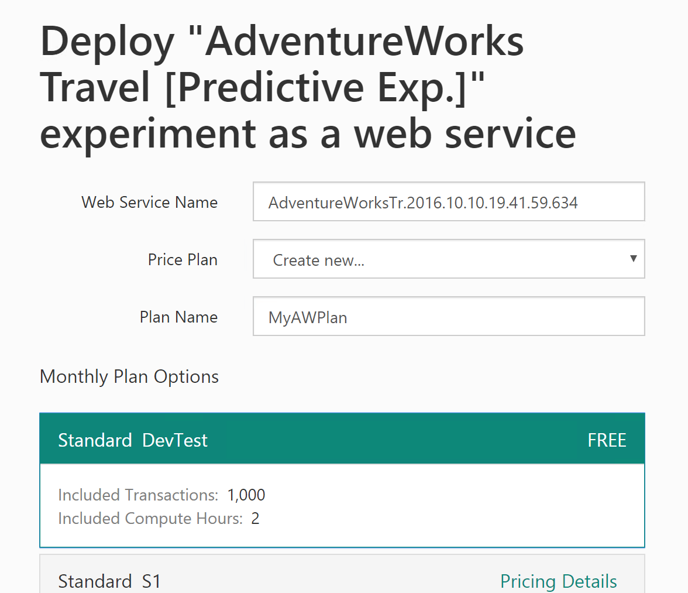
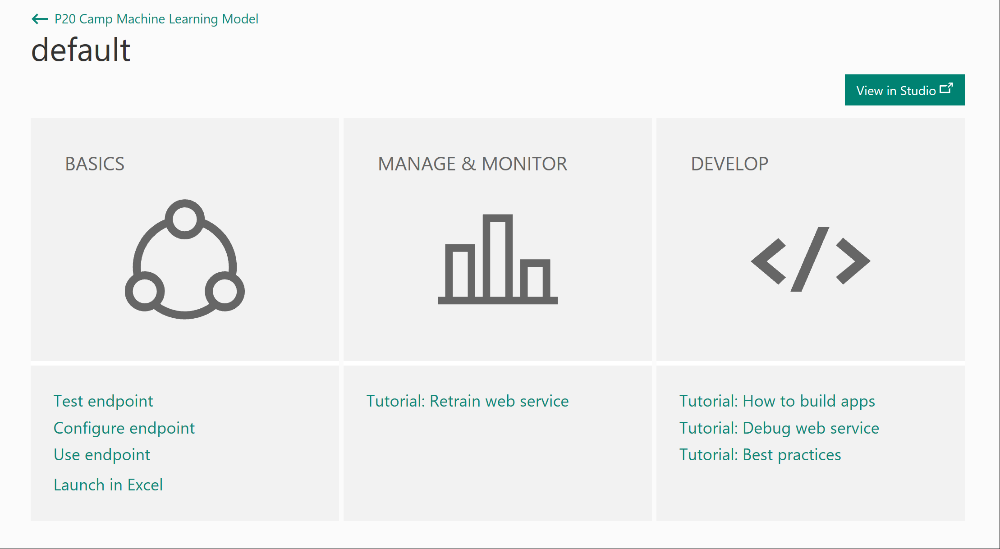
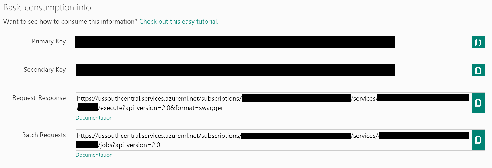

# Exercise 1: Building a Machine Learning Model

Duration: 90 mins

Synopsis: In this exercise, attendees will implement a classification experiment. They will load the training data from their local machine into a dataset. Then they will explore the data to identify the primary components they should use for prediction, and use two different algorithms for predicting the classification. They will evaluate the performance of both and algorithms choose the algorithm that performs best. The model selected will be exposed as a web service that is integrated with the sample web app.

This exercise has 9 tasks:

* [Task 1: Import the Predictive Experiment Into Your Workspace](#task-1-import-the-predictive-experiment-into-your-workspace)
* [Task 2: Examine the ML Experiment](#task-2-examine-the-ml-experiment)
* [Task 3: Run the predictive experiment](#task-3-run-the-predictive-experiment)
* [Task 4: Deploy Web Service and Note API Information](#task-4-deploy-web-service-and-note-api-information)

## Task 1: Import the Predictive Experiment Into Your Workspace

1. Go to [http://aka.ms/p20campmlmodel](https://aka.ms/p20campmlmodel). This will open an Azure ML predictive experiment in the Cortana Intelligence Gallery.
2. Click the **Open in Studio** button on the right side of the screen.

    
1. When prompted on the next screen, select the **South Central US** region and your workspace (Note: if you've worked with Azure ML befor you may have more than one workspace, it is important for subsequent steps to select the correct one.')

    
1. After the copy operation finishes, the completed ML experiment will appear in your workspace.

	

## Task 2: Examine the ML Experiment

1.  We need to at least put some steps in here to show off what is done in the experiment.

## Task 3: Run the predictive experiment

1. Run the experiment. This will take 5-7 minutes.

    

## Task 4: Deploy Web Service and Note API Information

1. When the experiment is finished running, click **Deploy Web Service**. This will launch the web service deployment wizard.  Upon reaching the dashboard, you'll be presented with an option to view the **New Web Services Experience** as seen below.  Please select this link and you will subsequently be re-directed to Step 4 if you are a Microsoft domain user.

	

1. You can leave the default name, select **Create new...** for **Price Plan** and then provide a **Plan Name** value. Finally, under **Monthly Plan Options** select **Standard DevTest**.
    1. **NOTE:**: If you have already created a DevTest plan, you will not be able to create another one. You can simply select the DevTest plan that was already created from the **Price Plan** dropdown box.

    

1. Scroll down and click the **Deploy** button. After deployment is completed, you will be taken to the web services **Quick Start** page for your new web service.

    
1. From the **Quick Start** page, click the **Use Endpoint** link.
2. Click the Copy button for the **Primary key**, open a copy of Notepad, and paste the value in the editor.
2. Click the Copy button for the **Request-Response** link. The URL will look something like the following:
    * https://ussouthcentral.services.azureml.net/subscriptions/[SOME_GUID]/services/[SOME_OTHER_GUID]/execute?api-version=2.0&format=swagger
1. The first GUID after subscriptions is your Workspace ID. The second GUID after services is your Service ID.
2. Copy each of these values into Notepad as well. Make sure you note which GUID is which because you will need these in a later step.
1. Finally, copy the **Batch Requests** URL to Notepad as well, but make sure to remove the '?' character and everything after it. You should be left with a URL that looks something like the following. Again, make sure to label this as your batch service in your Notepad instance.
    * https://ussouthcentral.services.azureml.net/subscriptions/[SOME_GUID]/services/[SOME_OTHER_GUID]/jobs

    

Next Exercise: [Exercise 2 - Setup Azure Components](02_Exercise_2_-_Setup_Azure_Components.md)
