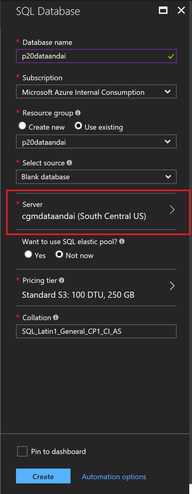
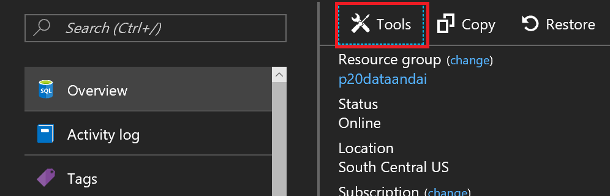

# Exercise 2: Setup Azure Components

Duration: 20 mins

Synopsis: In this exercise, attendees will create a baseline environment for Azure Data Factory development for further operationalization of data movement and processing. They will create a Data Factory service and then install the Data Management Gateway which is the agent that facilitates data movement from on-premises to Microsoft Azure.

This exercise has 2 tasks:

* [Task 1: Log in to the Azure Portal](#task-1-log-in-to-the-azure-portal)
* [Task 2: Create a SQL DB Account](#task-2-create-a-sql-db-account)
* [Task 3: Create new Azure Data Factory Service](#task-3-create-new-azure-data-factory-service)

## Task 1: Log in to the Azure Portal

1. Launch a new browser session and navigate to [https://portal.azure.com](https://portal.azure.com). Once prompted, log in with your Microsoft Azure credentials. If prompted, choose whether your account is an organization account or a Microsoft Account.  This will be based on which account was used to provision your Azure subscription that are using for these labs.
   - **Note** : You may need to launch an InPrivate/Incognito session in your browser if you have multiple Microsoft Accounts.

## Task 2:  Create a SQL DB Account

1. From left top corner of the Azure Portal, click on **+New**.

    

1.  Select **Databases**, click on **SQL Database**

    

1. Provide a name for the database like [insert your initials here]-p20database (example **cgm-p20database)
2. Make sure you have the right subscription selected.
3. For Resource Group, choose **Use Existing** and select the Resource Group you created when deploying the workshop prerequisites.
4. Select **Southcentral US for the retion.
5. Click on Server to select or create a new server.

    

1. Click on **Create a new server

    

1. Provide a name for the server (Note: it's perfectly fine to use the same name as the database for your server.)
2. Enter an administrator name and password.

    
 
1. You've returned to the database blade.  You're done with the data entry, click create and wait a couple minutes for provisioning to finish.

    

1. Once the database has been created, open the resoruce in the portal.
2. In the database overview blade click on "Tools".

    

1. Select "Query Editor (preview)".

    

1. Once you're into the query editor you'll need to authenticate to the database, click on the "Login" button.

    

1. The admin account will be populated by default, enter your administrator password and login.
2. You'll be in the query editory window now, enter the follwoing code: 

    ```sql
	CREATE TABLE ScoredFlightData
	(
		OriginAirportCode varchar(255)
		,[Month] bigint
		,DayofMonth bigint
		,CRSDepHour bigint
		,DayOfWeek bigint
		,Carrier varchar(255)
		,DestAirportCode varchar(255)
		,DepDel15 bigint
		,WindSpeed float
		,SeaLevelPressure float
		,HourlyPrecip float
		,ScoredLabels bigint
		,ScoredProbabilities float
		,OriginLatitude float
		,OriginLongitude float
	)

    ```
1. Click "Run".

    

1. TODO:  Enter steps for opening ports on the SQL firewall.


## Task 3: Create new Azure Data Factory Service

1. From left top corner of the Azure Portal, click on **+New**.

    

1. Select **Intelligence + analytics** , click on **Data Factory**.

    

1. Provide a name like [insert your initial here]-adf (example **jcho-adf** ).
2. Make sure to you have the right subscription selected.
3. For Resource Group, choose **Use Existing** and select the Resource Group you created when deploying the workshop prerequisites.
4. Select **East US** or **West US** for the region.
5. Check the box **Pin to dashboard** and click on the **Create** button.

    

1. Deployment of the ADF will take couple of minutes.
2. Once it has completed, you will be taken to the Data Factory blade.

    

Next Exercise: [Exercise 3 - Operationalize ML Scoring with Azure ML and Data Factory](03_Exercise_3_-_Operationalize_ML_Scoring_with_Azure_ML_and_Data_Factory.md)

