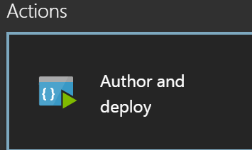
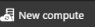
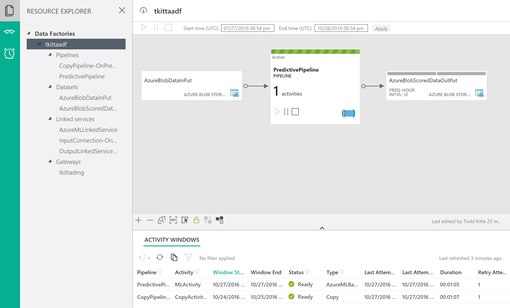

# Exercise 3: Operationalize ML Scoring with Azure ML and Data Factory

Duration: 20 mins

Synopsis: In this exercise, attendees will extend the Data Factory service to operationalize the scoring of data using the previously created ML model.

This exercise has 5 tasks:

* [Task 1: Create Azure Storage Linked Service](#task-1-create-azure-storage-linked-service)
* [Task 2: Create Azure ML Linked Service](#task-2-create-azure-ml-linked-service)
* [Task 3: Create Azure ML Input Dataset](#task-3-create-azure-ml-input-dataset)
* [Task 4: Create Azure ML Scored Dataset](#task-4-create-azure-ml-scored-dataset)
* [Task 5: Create Azure ML Predictive Pipeline](#task-5-create-azure-ml-predictive-pipeline)
* [Task 6: Monitor Your Pipeline Activities](#task-6-monitor-your-pipeline-activities)


## Task 1: Create Azure Storage Linked Service

1. Go back to the **Azure Data Factory** service blade.
2. Click on the **Author and deploy** from **Actions** section.

    

1. Click on **New data store

    

1. Click on **Azure Storage

    

1. In the new window, be sure change the JSON file to match the following:

    ```json
    {
        "name": "AzureStorageLinkedService",
        "properties": {
            "type": "AzureStorage",
            "description": "",
            "typeProperties": {
                "connectionString": "DefaultEndpointsProtocol=https;AccountName=p20dataandaistorage;AccountKey=AokDYBsLEt0jgFteM+9cyPIWNOUO4aVq/lqPIuu1Lv+8wO8cy7y1J6IyFGC9imhj3Mf1pg848AkVtO+Pf+s9sA=="
            }
        }
    }
    ```
 1. Click **Deploy**.

## Task 2: Create Azure ML Linked Service

1. Click on **…More**.

    
1. Click on **New Compute**.

    
1. Select **Azure ML** from the list.
2. In the new window, be sure change the JSON file to match the following:
    * Back in [Exercise 1, Task 9](01_Exercise_1_-_Building_a_Machine_Learning_Model.md#task-9-deploy-web-service-and-note-api-information) you noted some values related to your ML web service. The value for **mlEndPoint**  below is your web service's **Batch Requests** URL (remembering to remove the query string), and **apiKey** is the **Primary Key** of your web service.

    ```json
    {
        "name": "AzureMLLinkedService",
        "properties": {
            "type": "AzureML",
            "description": "",
            "typeProperties": {
                "mlEndpoint": "<Specify the batch scoring URL>",
                "apiKey": "<Specify the published workspace model's API key>"
            }
        }
    }
    ```
1. Prior to Deploying, please ensure to delete **Optional** property values.  Now click **Deploy**.

## Task 3: Create Azure ML Input Dataset

1. Click on **…More**.

    
1. To create new dataset that will be copied into Azure Blob storage, click on the **New dataset** from the top.

   
1. Select **Azure Blob storage** from the list.
2. In the new window, be sure change the JSON file to match the following or copy the below JSON text and paste into the browser window.

    ```json
    {
        "name": "AzureBlobDataInPut",
        "properties": {
            "type": "AzureBlob",
            "external": true,
            "linkedServiceName": "AzureStorageLinkedService",
            "typeProperties": {
                "fileName": "FlightsAndWeather.csv",
                "folderPath": "flightdata",
                "format": {
                    "type": "TextFormat"
                }
            },
            "availability": {
                "frequency": "Hour",
                "interval": 12
            }
        }
    }
    ```
1. Click Deploy.

## Task 4: Create Azure ML Scored Dataset

1. Click on **…More**.

    
1. Click on the **New dataset**.

    
1. Select **Azure Blob storage** from the list.
2. In the new window, be sure change the JSON file to match the following or copy the below JSON text and paste into the browser window.

    ```json
    {
        "name": "AzureBlobScoredDataOutPut",
        "properties": {
            "type": "AzureBlob",
            "linkedServiceName": "AzureStorageLinkedService",
            "typeProperties": {
                "fileName": "Scored_FlightsAndWeather.csv",
                "folderPath": "flightdata",
                "format": {
                    "type": "TextFormat"
                }
            },
            "availability": {
                "frequency": "Hour",
                "interval": 12
            }
         }
    }
    ```
1. Click **Deploy**.

## Task 5: Create Azure ML Predictive Pipeline

1. Click on **…More**.

    
1. Click on the **New pipeline**.

    
1. In the new window, be sure change the JSON file to match the following or copy the below JSON text and paste into the browser window.

    ```json
    {
        "name": "PredictivePipeline",
        "properties": {
            "description": "Use AzureML model",
            "activities": [
                {
                    "type": "AzureMLBatchExecution",
                    "typeProperties": {
                        "webServiceInput": "AzureBlobDataInPut",
                        "webServiceOutputs": {
                            "output1": "AzureBlobScoredDataOutPut"
                        },
                        "globalParameters": {}
                    },
                    "inputs": [
                        {
                            "name": "AzureBlobDataInPut"
                        }
                    ],
                    "outputs": [
                        {
                            "name": "AzureBlobScoredDataOutPut"
                        }
                    ],
                    "policy": {
                        "timeout": "02:00:00",
                        "concurrency": 1,
                        "executionPriorityOrder": "NewestFirst",
                        "retry": 1
                    },
                    "name": "MLActivity",
                    "description": "prediction analysis on batch input",
                    "linkedServiceName": "AzureMLLinkedService"
                }
            ],
            "start": "2016-09-14T00:00:00Z",
            "end": "2016-09-15T00:00:00Z"
        }
    }
    ```
1. Make sure to change the start to today's date and end to today + 1 date.
2. Click **Deploy**.

## Task 6: Monitor Your Pipeline Activities

1. Close the current blade by clicking on the **X** from the top right corner of the blade.
2. Click on the **Monitor &amp; Manage** from the **Actions** section.
3. Maximize the new window and you can see the diagram view of the data flow.

    
1. You should start to see **Ready** status activity listed on the bottom of the new window (May take a few minutes for status to turn Ready).
2. Close the **Monitor &amp; Manage** browser tab.

Next [Exercise 4 - Develop Data Factory Pipeline for Data Movement](04_Exercise_4_-_Develop_Data_Factory_Pipeline_for_Data_Movement.md)
