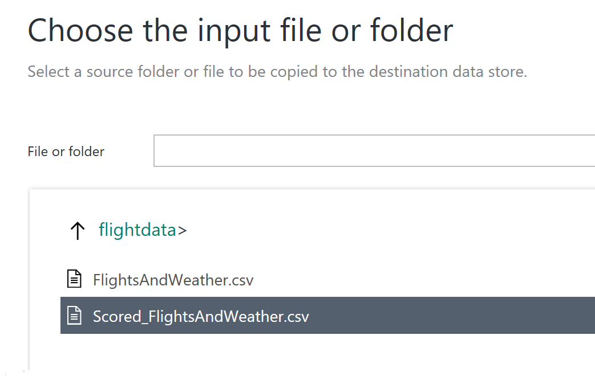

# Exercise 4: Develop Data Factory Pipeline for Data Movement

Duration: 20 mins

Synopsis: In this exercise, attendees will implement Azure Data Factory pipeline to copy data (.csv file) from on-premises server (lab virtual machine) to Azure Blob Storage. The goal of the exercise is to demonstrate data movement from an on-premises location to Azure Storage (via the Data Management Gateway). The attendee will see how these assets are created, deployed, executed, and monitored.

## Task 1: Create Copy Pipeline Using the Copy Data Wizard

1. Go the Azure Portal and select Azure Data Factory (ADF) Service you create in previous exercise.

    

1. From **Actions** section, click on **Copy data**.

    

1. New browser window will open.  Under Properties tab, type in **CopyScoredData2SQL**.

    

1. Optional: Type in a description like: **This copies the scored data from blob storage to SQL Azure.**.
2. Select the **Run once now** option.
3. Click on the **Next** button from the bottom of the screen.
4. From the Source Data Store screen tab, select **Azure Blob Storage**.

    

1. Click on **Next** button from the bottom of the screen.
2. From the "Specify the Azure Blob storage account" tab, type **InputCSVBlob** into the **Connection name** textbox.
3. For the **Azure Subscription**, select the Azure subscription you're presently using for the lab.
4. For the **Storage Account**, select the storage account where you output the scored data.

    

1. Click on the **Next** button from the bottom of the screen.
2. From the **Choose the input file or folder** tab, click on the **Flightdata** folder.

    

1. Click on the "Scored_FlightsAndWeather.csv"

    

1. Click "Choose".
2. Click "Next".
3. The wizard will parse the file to come up with default settings for the csv.  For the most part these are good, but we need to correct one error.
4. Click on "Schema" on the **File format settings** screen.

    

1. The view will switch to a list of fields and their data types, click "Edit".

    

1.  Scroll down to "WindSpeed", and switch its data type from "Int64" to "Double".

    

1. Click "Next".
2. From the **Destination data store** tab, click on the **Azure SQL Database**.
2. Click on the **Next** button from the bottom of the screen.

    

1. From the **Specify the Azure SQL Database** tab, Type in **DestinationSQL** into the **Connection name**.
2. Select the appropriate "Subscription", and "Database".
3. Enter the credentials you used while provisioning the database.
4. Click on the **Next** button.

    

1. From the "Table mapping" screen, choose the only table available which should be "[dbo].[ScoredFlightData]"
2. Click on the **Next** button from the bottom of the screen.

    

1. The schema will auto map because the column names match.  Click on the **Next** button.

    

1. Select the default repeatability settings and click **Next**.
2. Review the summary tab and click **Finish** button from the bottom.
3. You should see a **Deploying** status. This process will take few minutes and see the **Deployment Complete** status on top of the screen.

    

1. Click on the hyperlink **Click here to monitor copy pipeline**.
2. From the **Resource Explorer** , you should see from the **Activity Windows** (bottom of the screen) the pipeline activity status **Ready**. This indicates the CSV file was successfully copied from your VM to your Azure Blob Storage location.

    

Next Exercise: [Exercise 5 - Visualizing in Power BI Desktop](05_Exercise_5_-_Visualizing_in_Power_BI_Desktop.md)
