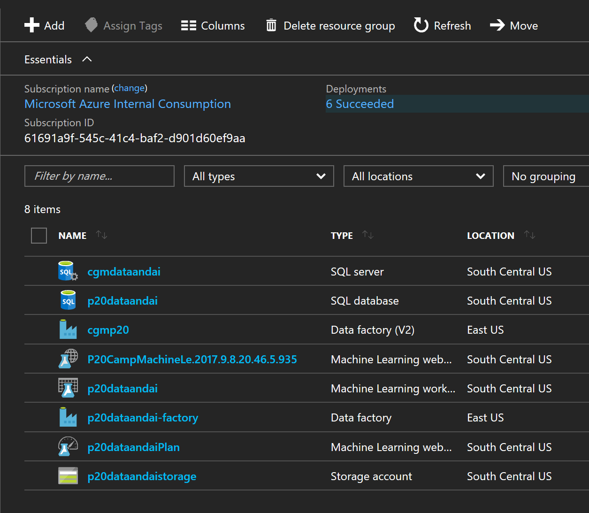
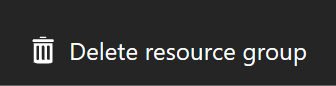
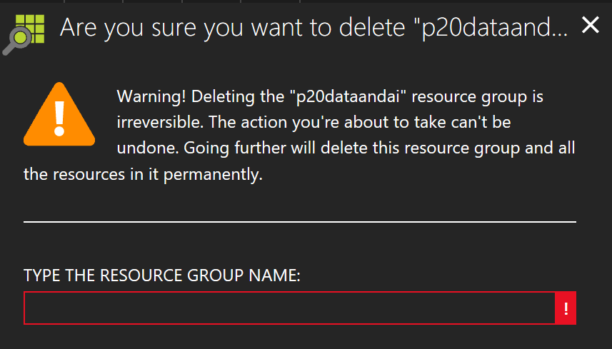

# Exercise 6: Cleanup of Azure Resources

Duration: 5 mins

Synopsis: In this exercise, attendees will de-provision any Azure resources that were created in support of the lab.

## Task 1: Delete Resource Group

1. Using the Azure Portal, navigate to the Resource Group that you used throughout the lab by clicking on **Resource Groups** in the left nav.

    
1. Navigate to the approrpaite resoruce group and select it.  You'll be shown a list of all the resoruces created for this lab.

    

1. You can delete the entire resoruce group by clicking the  **Delete Resource Group** button.

    

1. You'll be asked to confirm the name of the resource group before deleting.  Enter the appropriate resource group name and click the **Delete** button.
    
