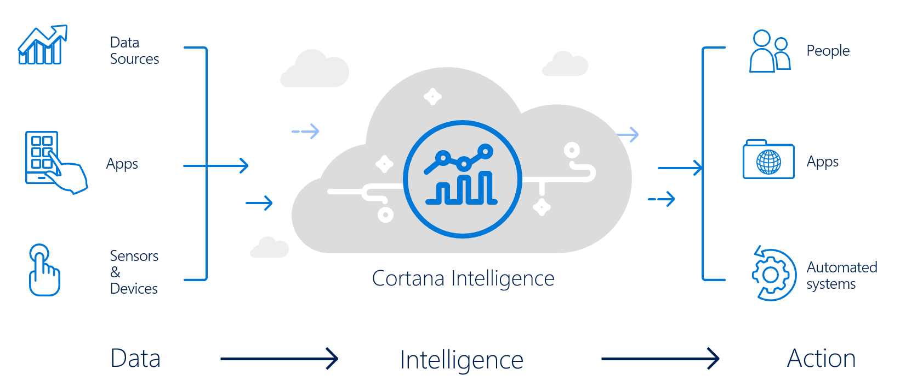
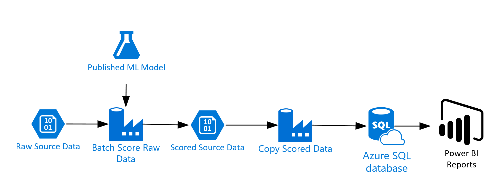

# P20 Data & AI Hands on Experience

This set of exercises is intended to give you some hands on experience with the Cortana Intelligence Suite, which makes includes much of the Azure Data and Analytics products.  Given the limited time we will restrict teh set of exercises to a single scenario that follows a set of data form acquisition to visualziation using several of the Cortana Intelligence Suite components.

# Workshop Scenario Overview

Greyjoy Travel Services provides concierge transportation services for Westerosi travelers. In an increasingly crowded market, they are always looking for ways to differentiate themselves and provide added value to their customers.

They are looking to pilot a web-app that their internal customer service agents can use to provide additional information useful to the traveler during the booking process. They want to enable their agents to enter in the flight information and produce a prediction as to if the departing flight will encounter a 15 minute or longer delay, taking into account the weather forecasted for the departure hour.

In this workshop, we will deploy the inital Machine Learning model and also do some batch scoring and visualization of flight delay data.

# Workshop Architecture
The workshop uses several, but not nearly all, of the components that are part of [Cortana Intelligence Suite](https://www.microsoft.com/en-us/cloud-platform/cortana-intelligence-suite). The goal is to show an end-to-end solution and not necessarily try to work in every component possible. The workshop architecture is below and includes:

- Azure ML
- Azure Data Factory
- Azure Storage
- Azure SQL Database
- Power BI

# Requirements

- A Microsoft Azure Subscription.
- An install of Power BI Desktop.
- Connectivity to the internet. 

# Exercises

- [Exercise 1 - Deploying a Machine Learning Model](01_Exercise_1_-_Deploying_a_Machine_Learning_Model.md)
- [Exercise 2 - Setup Azure Components](02_Exercise_2_-_Setup_Additional_Azure_Components.md)
- [Exercise 3 - Operationalize ML Scoring with Azure ML and Data Factory](03_Exercise_3_-_Operationalize_ML_Scoring_with_Azure_ML_and_Data_Factory.md)
- [Exercise 4 - Develop Data Factory Pipeline for Data Movement](04_Exercise_4_-_Develop_Data_Factory_Pipeline_for_Data_Movement.md)
- [Exercise 5 - Visualizing in Power BI Desktop](05_Exercise_5_-_Visualizing_in_Power_BI_Desktop.md)
- [Exercise 6 - Cleanup of Azure Resources](06_Exercise_6_-_Cleanup_of_Azure_Resources.md)
